# Room: [Brooklyn Nine Nine](https://tryhackme.com/room/brooklynninenine)

## Overview
This write‑up covers the *Brooklyn Nine Nine* room on [TryHackMe](https://tryhackme.com), created by [Fsociety2006](https://tryhackme.com/p/Fsociety2006).
The objective is to gain root access to the target machine by capturing two flags: a user flag and a root flag.
The room can be completed in two different ways, offering multiple paths to ownership.

## Setup
- Tools used: nmap, gobuster, wget, steghide, stegcrack, hydra.
- Notes: My initial focus was simply to gain access. Afterwards, I retraced my steps to follow the intended path “correctly,” and later explored the alternative method to achieve root access.

---

## Method 1
I began with enumeration to understand the target environment and gather clues for my next steps.

For this, I ran the following command:

```bash
nmap -sC -sV <Target IP> 
```

The output revealed useful information about the services running on the target.

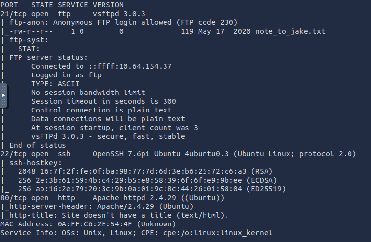

The scan shows FTP, SSH, and HTTP open ports.

I decided to go the HTTP service route and opened the Target IP in my browser.


The page only displayed an image with some text below it.

Suspecting there might be hidden content, I launched Gobuster to brute‑force directories:

```bash
gobuster dir -u http://<Target IP> -w /usr/share/wordlists/dirb/common.txt
```

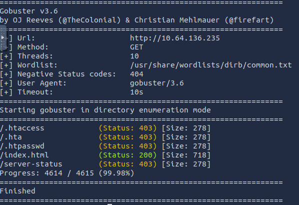

But did not find anything, so I had to look elsewhere.

There had to be something on the webpage so I opened inspect mode.

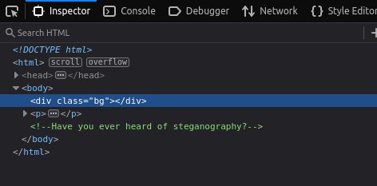

A clue pointing toward steganography was revealed thanks to it.

There was only one image on the page so I got its name from the source code.

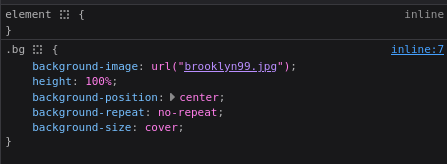

The image name was `brooklyn99.jpg`

I downloaded the image locally using wget.

```bash
wget http://<Target IP>/brooklyn99.jpg
```

Then, I attempted to extract hidden data using steghide.

```bash
steghide extract -sf brooklyn99.jpg
```

I was prompted for a password, which confirmed I was on the right track.
I tried a few common passwords and succeeded on my second attempt - The password was weak and easily guessed.

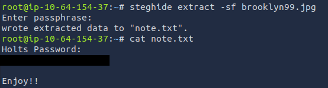

This revealed valid credentials for the holt user account.

Using those credentials, I logged in via SSH:

```bash
ssh holt@<Target IP>
```

And obtained the user flag.

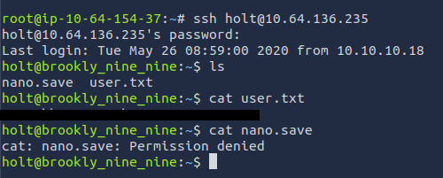

With `sudo -l`, I was able to verify holt's permissions:

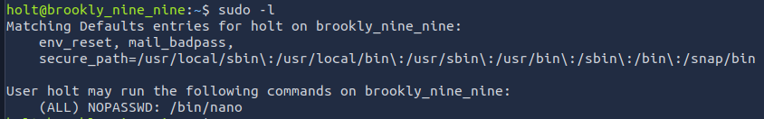

Turns out holt can run nano as root and without a password.

Since the user flag was at `/home/holt`, I decided to open `/root` directly with nano.

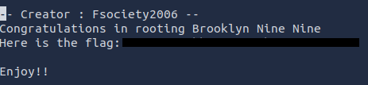

And got the root flag.

At this point, the room was finished.
Still, I wasn't satisfied.
I had to go back.

---

## Backtracking

My first run relied on guessing, which gave me the flag but not actual root access.

This approach would never be acceptable in a real engagement.

So I made the decision to go back.

I wanted to do it the right way and actually escalate privileges.

Documenting both approaches highlights the difference between “getting lucky” and developing the skills needed to truly pwn a machine.

---

## Method 1 - Privilege Escalation (Correct Path)

I replicated the scenario in a home lab to understand how limited `/bin/nano` privileges could be abused after struggling with escalation.

It was during this process that I realized the 'sudoers' file had been available all along. 
The escalation path was clear.

I opened the sudoers file using nano and modified it to grant myself full permissions.

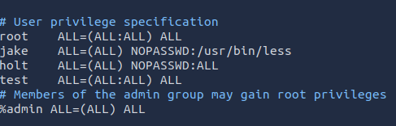

Replacing `/bin/nano` with `ALL`

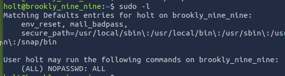

Result in terminal

With that change in place, I ran:

```bash
sudo su root
```
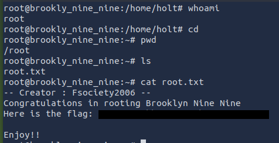

This time I not only obtained the root flag, but full root access.

---

The *brooklyn99.png* password can be obtained with:

```bash
stegcracker brooklyn99.jpg /usr/share/wordlists/rockyou.txt
```

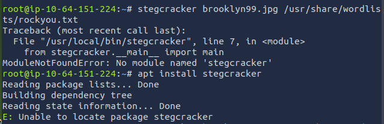

Stegcracker was not available on the THM machine, so I couldn’t brute force the password like I had done on my home lab.

---

## Method 2


Nmap showing port 21 with FTP open and anonymous login allowed.

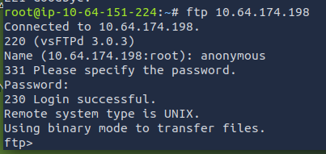

I logged in anonymously, without a password.

After listing the contents of the server, I found a note left by Amy. 

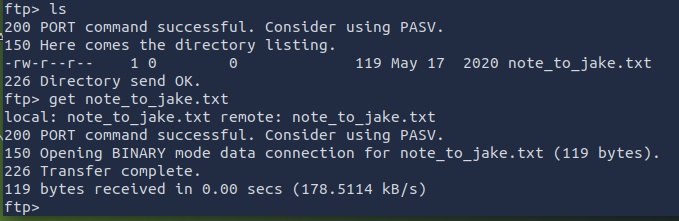

Using:

```bash
get note_to_jake.txt
```

I transferred it to my machine.

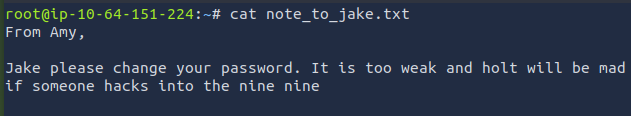

The note suggested Jake’s password was weak.

I used Hydra with the `rockyou.txt` wordlist to brute force jake's SSH login:

```bash
hydra -l jake -P /usr/share/wordlists/rockyou.txt ssh://<Target IP>
```

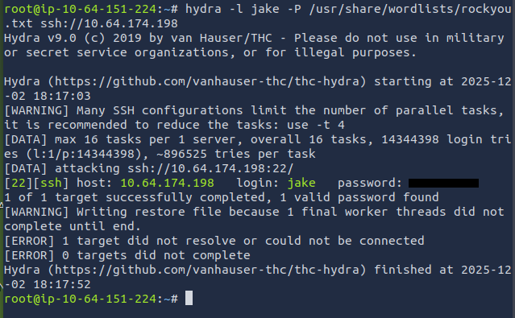

I was then able to log in as jake and list his permissions.

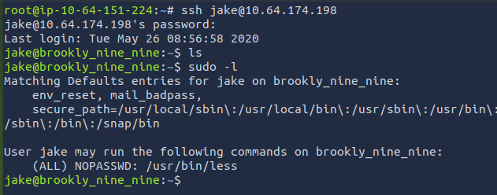

Jake can run the `less` command with `sudo`.

According to [GTFOBins](https://gtfobins.github.io/),this can be abused to escalate privileges.

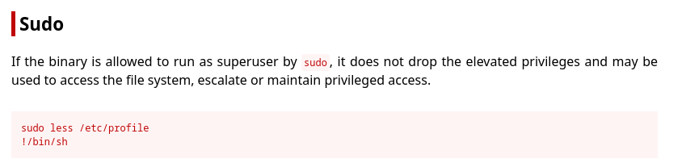

As we can see here.

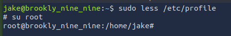

---

## Final Notes

This room highlights several common misconfigurations and weaknesses:
- Anonymous FTP login.
- Weak passwords.
- Sudo misconfigurations.

The exercise reinforces the importance of:
- Careful enumeration of services and files.
- Testing multiple approaches rather than relying on a single path.
- Understanding how seemingly harmless sudo permissions can be abused.
