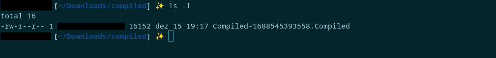
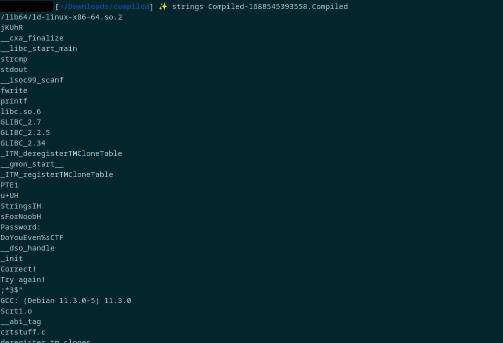
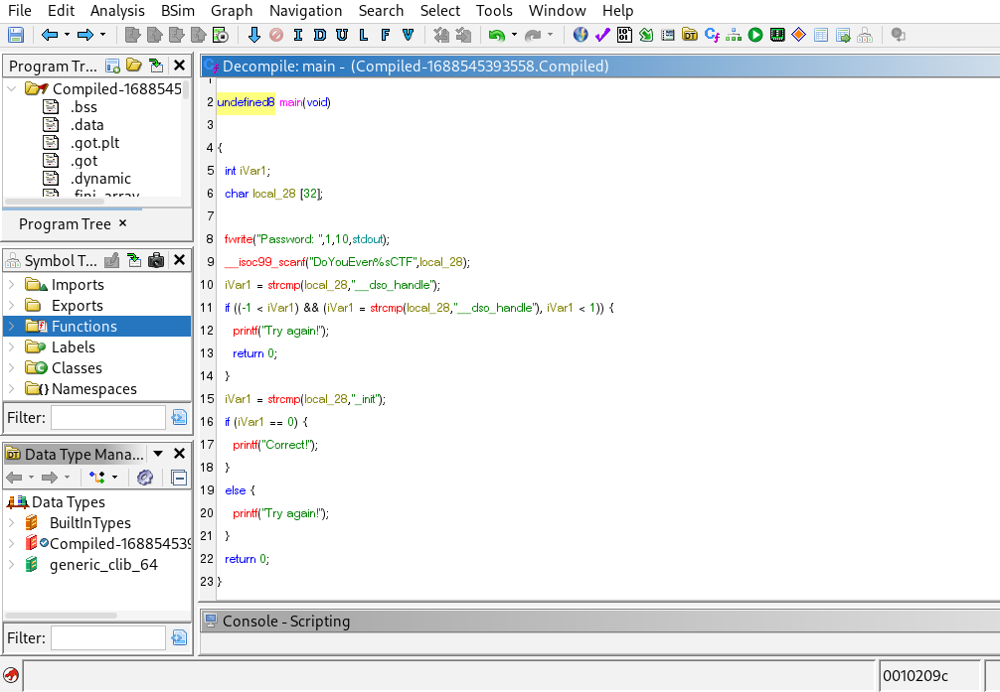

# Room: [Compiled](https://tryhackme.com/room/compiled)

## Overview
This write‑up covers the *Compiled* room on [TryHackMe](https://tryhackme.com), created by [tryhackme](https://tryhackme.com/p/tryhackme), [nerrorsec](https://tryhackme.com/p/nerrorsec) and [rePl4stic](https://tryhackme.com/p/rePl4stic).

The objective of this room is to practice basic reverse engineering by extracting a hardcoded password from a compiled binary.

## Setup
- **Tools used:** ghidra.
- **Techniques:** Static analysis, Reverse engineering.
- **Notes:** This one was more about tooling and interpretation than technical difficulty.

---

## Method

I started by downloading the file provided by the room onto my machine, placing it in a dedicated working directory before beginning analysis.

Attempting to read the file confirmed that it was already compiled, just as the room name suggested.

Although most of the content appeared as gibberish, a few readable strings were visible within the binary.

Using the `strings` command to filter out the gibberish, it’s possible to get a cleaner view.

From the output, several interesting clues appear:

`GCC: Debian (11.3.0-5) 11.3.0` shows the binary was compiled with GCC on Debian.

`libc_start_main`, `printf`, `fwrite`, `stdout`, `libc.so.6`  are typical C standard library functions, confirming the binary is likely written in C.

`"correct"`, `"password"`, `"try again"` are clear indicators of program logic.

`strcmp` is a C function that suggests the program compares user input against a hardcoded password.

`DoYouEven%sCTF`  looks like a variable or placeholder, and testing it directly as the password fails.

At this stage, `strings` gives us useful hints about the program’s behavior, but not the actual password, so my next step was to decompile the binary with Ghidra to confirm the logic and extract the hardcoded value.

From analyzing this code, it becomes clear how the program validates input and which value ultimately serves as the flag.

---
