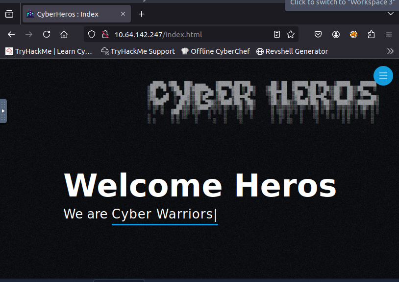
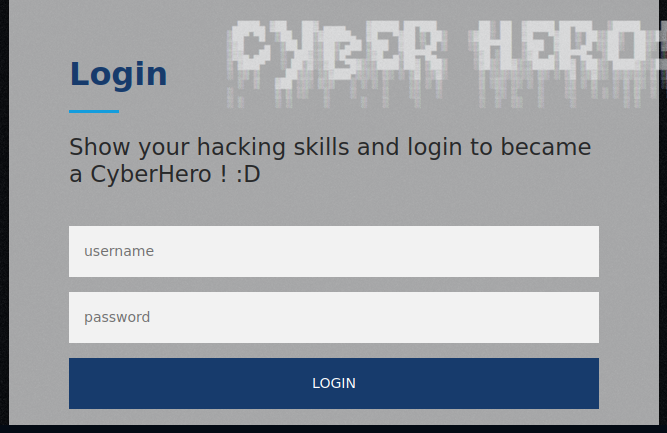
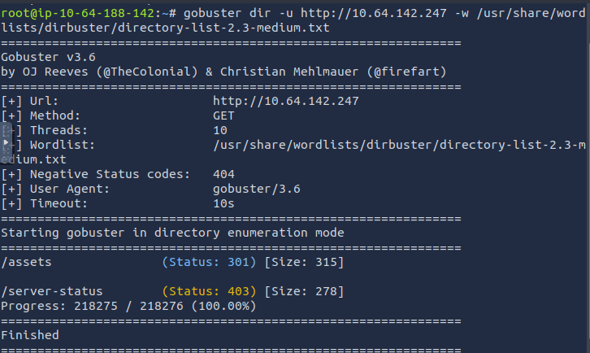
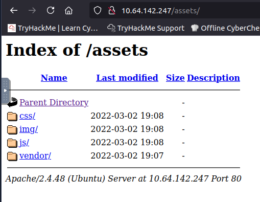
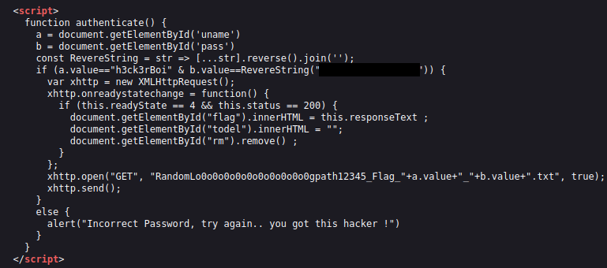
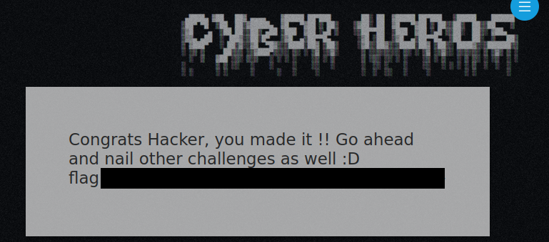

# Room: [CyberHeroes](https://tryhackme.com/room/cyberheroes)

## Overview
This write‑up covers the *Cyber Heroes* room on [TryHackMe](https://tryhackme.com), created by [tryhackme](https://tryhackme.com/p/tryhackme), [cmnatic](https://tryhackme.com/p/cmnatic) and [THMDan](https://tryhackme.com/p/THMDan).

The objective is to log in to the CyberHeroes website.

## Setup
- Tools used: gobuster was used for enumeration but it is not required to solve the room.
- Notes: The challenge demonstrates that sometimes the simplest approach is enough.
---

## Method 

I started by inserting the target IP address into my browser as instructed.

Navigating the website I found the login page.

I decided to run a gobuster scan to look for hidden directories and discovered `/assets`.

Inside `/assets` there were other directories, but none contained useful content.

At this point, I decided to inspect the source code of the login page and found hardcoded credentials.

Entering these credentials into the login form yielded the flag.

---

## Final Notes

#### This room highlights the following misconfigurations and/or weaknesses:

- Hardcoded credentials in source code.
- Exposed directories.

