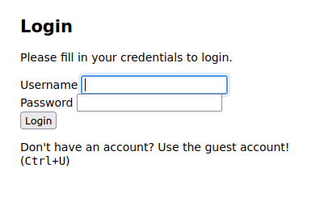
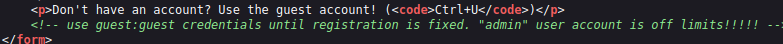
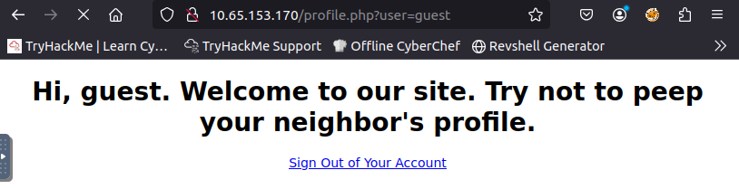
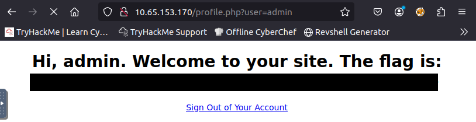

# Room: [Neighbour](https://tryhackme.com/room/neighbour)

## Overview
This write‑up covers the *Neighbour* room on [TryHackMe](https://tryhackme.com), created by [cmnatic](https://tryhackme.com/p/cmnatic).

The objective of this room is to exploit a web vulnerability to gain access to the admin account.

## Setup
- Tools used: None
- Notes: This is one of TryHackMe’s 5‑minute hacks, and it turned out to be simpler than expected.
---

## Method 

I began by entering the Target IP into my web browser as directed.

This brought up a simple login page.

As the website instructed, I opened the browser's inspect mode and got a clue.

Guest credentials were exposed in an HTML comment.

Using them, I looged in as guest.

I quickly noticed the url parameter `user=guest` and altered it to `user=admin`.

With admin access now granted, I got the flag.

---

## Final Notes

This room highlights several common misconfigurations and weaknesses:

- Exposure of credentials within HTML comments.
- Reliance on insecure URL parameters.

The exercise reinforces the importance of:

- Maintaining clean source code.
- Validating and sanitizing user input.

- Enforcing proper access control.

