# Room: [TakeOver](https://tryhackme.com/room/takeover)

## Overview
This write‑up covers the *TakeOver* room on [TryHackMe](https://tryhackme.com), created by [JohnHammond](https://tryhackme.com/p/JohnHammond), [fumenoid](https://tryhackme.com/p/fumenoid), [timtaylor](https://tryhackme.com/p/timtaylor) and [cmnatic](https://tryhackme.com/p/cmnatic).

The objective of this room is to identify how attackers could potentially take over the `futurevera.thm` website.

---

## Setup
- **Tools used:** nmap, gobuster
- **Techniques:** Virtual host enumeration, Basic web reconnaissance.
- **Notes:** After expanding my enumeration to include virtual host discovery, the rest of the challenge became much clearer.

---

## Methodology

To begin, I added the target machine’s IP address to `/etc/hosts`, mapping it to the domain `futurevera.thm` so it resolves correctly during enumeration.

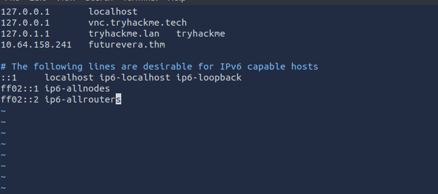

I then navigated to `https://futurevera.thm`, which produced a certificate warning.

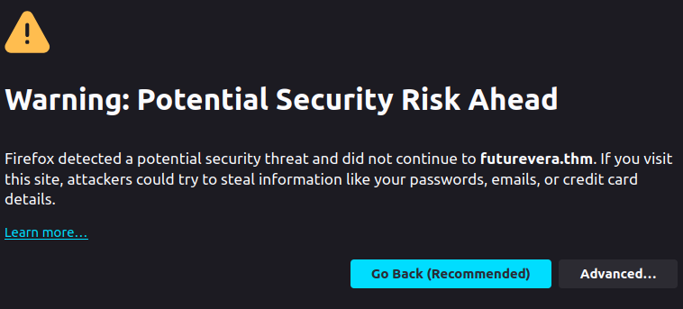

Investigating the certificate didn’t reveal anything useful, so I selected `Advanced` and continued to the site.

This brought me to the homepage.


I ended up not finding anything by navigating through the website or inspecting the source code, so I moved on to scanning the target with nmap.

```bash
nmap futurevera.thm
```

Which revealed three open TCP ports: 22 (`ssh`), 80 (`http`), and 443 (`https`).

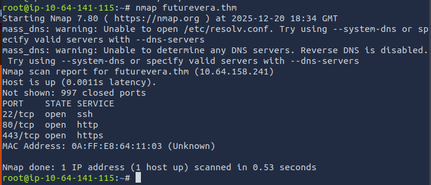

I continued with web enumeration using gobuster to look for additional directories.

```bash
gobuster dir -u https://futurevera.thm -k -w /usr/share/wordlists/dirb/common.txt
```

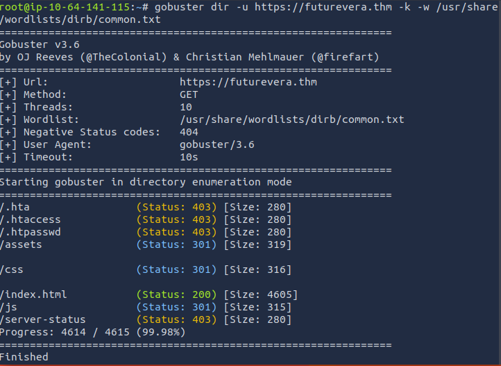

The scan revealed `/index.html`, which simply redirected back to the homepage, along with three additional directories: `/assets`, `/css`, and `/js`, all of which contained only the site’s static code and assets.

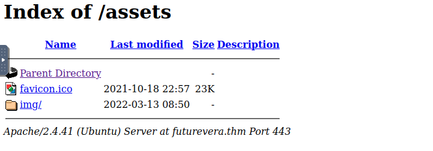    
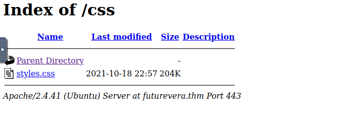    
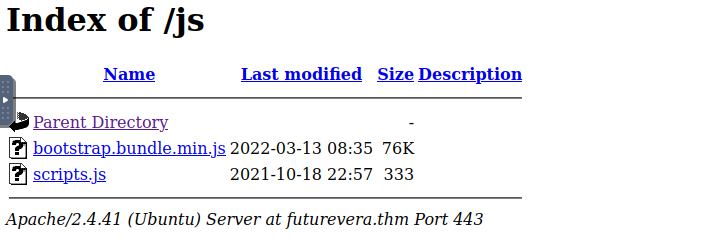

Next, I moved on to virtual host enumeration using Gobuster:

```bash
gobuster vhost -u https://futurevera.thm --append-domain -k -w /usr/share/wordlists/SecLists/Discovery/DNS/subdomains-top1million-5000.txt
```

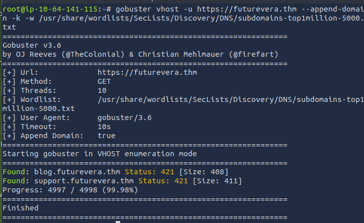

The vhost enumeration revealed two additional subdomains: `blog.futurevera.thm` and `support.fururevera.thm`.

I added both entries to my `/etc/hosts` file so they would resolve locally.

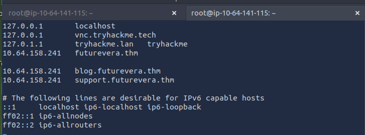

Accessing these subdomains triggered the usual certificate warning. 

While checking one of them, I found out another exposed hostname.


I added this newly discovered domain to the hosts file as well.

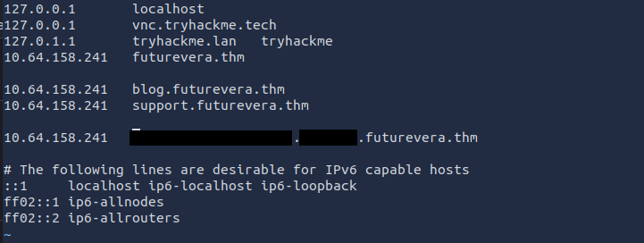

Visiting this final subdomain revealed the flag.

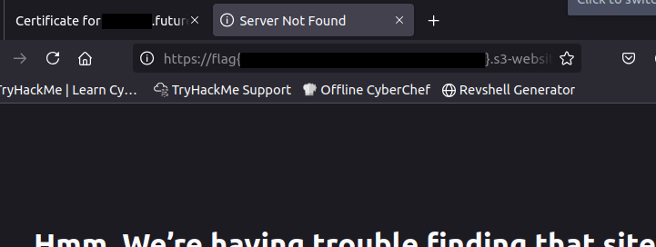


---
